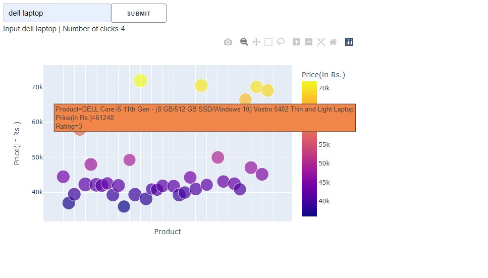
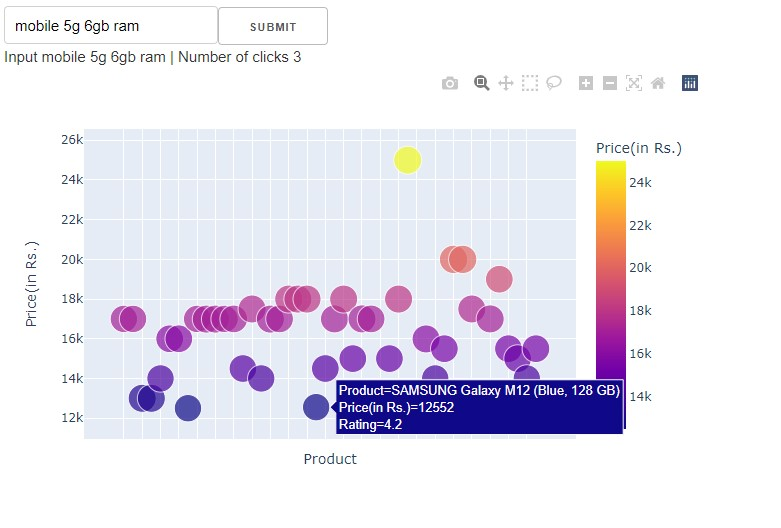

# E-Commerce Web Scraping App
This repository contains code for a full-stack web-based Python application for web-scraping the product details from an Ecommerce website. 

## How to use it?
- Make a [Virtual Environment](https://gist.github.com/yesdeepakmittal/61494217c8be4a7e61524e27824943bd) and activate it.
- Clone this repository `git clone https://github.com/yesdeepakmittal/web-scrapping-ecommerce-website-python-app.git`
- `cd web-scrapping-ecommerce-website-python-app`
- `pip install -r requirements.txt`
- run application using `python won.py`
- Check your application in the browser at `http://127.0.0.1:8050/` 

## Overview

## Note
Feel free to open an issue to discuss the working of this Python application.
